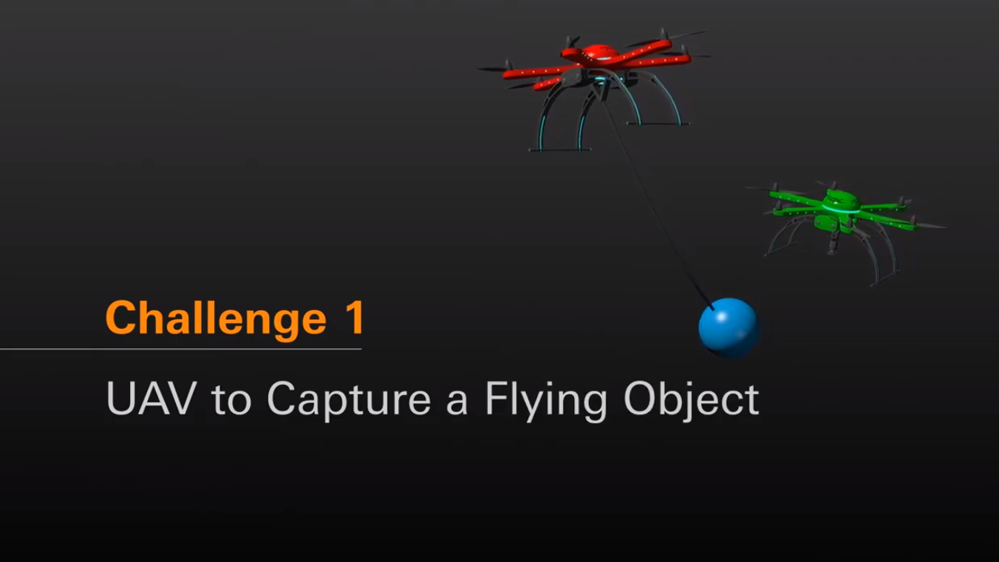

# MBZIRC 2020 Challenge1
## Task rule: please refer to [official website](https://www.mbzirc.com/challenge/2020)

## Packages:

- [mbzirc2020_task1_common](https://github.com/tongtybj/aerial_robot_demo/tree/mbzirc2020_task1_unstable/mbzirc2020/mbzirc2020_task1/mbzirc2020_task1_common): general component and configuration for transformable aerial robot platform (Hydrus) and simuation
- [mbzirc2020_task1_vision](https://github.com/tongtybj/aerial_robot_demo/tree/mbzirc2020_task1_unstable/mbzirc2020/mbzirc2020_task1/mbzirc2020_task1_vision): vision part for this Challenge, also include the training procedure for drone-ball detection
- [mbzirc2020_task1_task](https://github.com/tongtybj/aerial_robot_demo/tree/mbzirc2020_task1_unstable/mbzirc2020/mbzirc2020_task1/mbzirc2020_task1_tasks): the motion planning and control for autonomous interception, and the command to perform the whole system. 

## How to Use:

Please follow the instuction in [this README.md](https://github.com/tongtybj/aerial_robot_demo/blob/mbzirc2020_task1_unstable/mbzirc2020/mbzirc2020_task1/mbzirc2020_task1_tasks/README.md)
