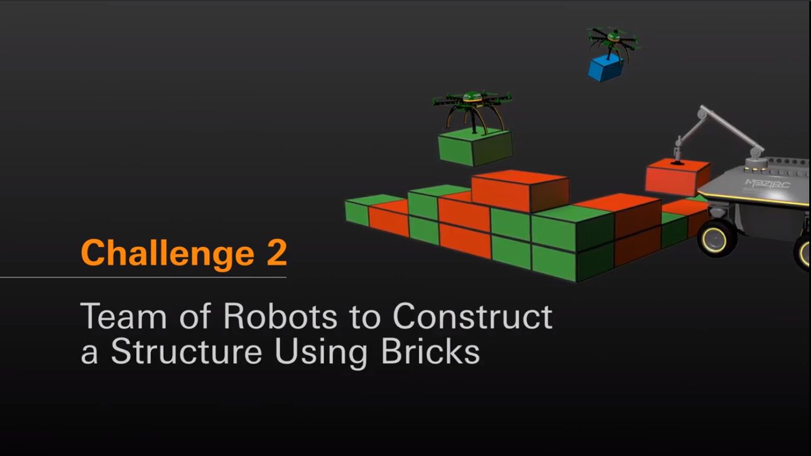

# MBZIRC 2020 Task2
## Task rule: please refer to [official website](https://www.mbzirc.com/challenge/2020)



## Bringup

### real machine
```
$ roslaunch mbzirc2020_task2_common bringup.launch
```

### real machine including motion and recognition
```
$ roslaunch mbzirc2020_task2_common challenge.launch
```

### simulation (including motion and recognition)
Default
```
$ roslaunch mbzirc2020_task2_simulation simulation.launch
```

Light world
```
$ roslaunch mbzirc2020_task2_simulation simulation.launch world:=light
```


## Ground Vehicle Model

### real machine
```
$ roslaunch mbzirc2020_task2_common bringup.launch ground_mode:=True
```

### simulation
```
$ roslaunch mbzirc2020_task2_common bringup.launch real_machine:=False simulation:=True headless:=False ground_mode:=True
```
