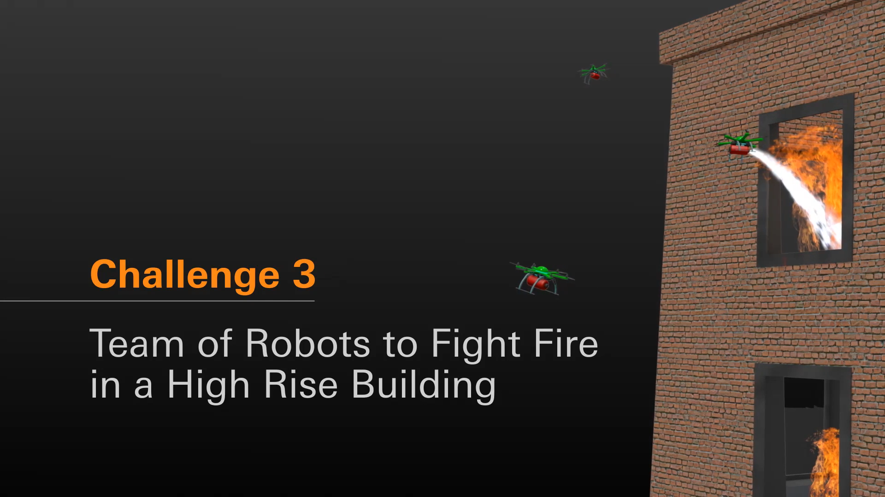

# MBZIRC 2020 Task3
## Task rule: please refer to [official website](https://www.mbzirc.com/challenge/2020)



## Bringup

### real machine
```
$ roslaunch mbzirc2020_task3_tasks motion.launch motion_config_filename:=motion_outdoor.yaml waypoint_config_filename:=your_waypoints.yaml
```

### simulation
```
$ roslaunch mbzirc2020_task3_tasks motion.launch  real_machine:=false simulation:=true headless:=false motion_config_filename:=motion_simulation.yaml waypoint_config_filename:=waypoint_simulation.yaml
```

## Start motion
```
$ rostopic pub -1 /task3_start std_msgs/Empty "{}"
```

## Other tips

Create config yaml file for tasks with gps module
```
$ roslaunch spinal_ros_bridge serial.launch
$ rosrun mbzirc2020_task3_tasks record_4_corner_yaml.py

```


### if you want to use the horizontal VIO (realsense T265) in indoor enviroment, please:

   1. attach the horizontal VIO sensor module
   2. do following command:
   ```
   $ roslaunch mbzirc2020_task3_tasks motion.launch horizontal_vio:= true
   ```

*note*: horizontal vio sensor provides bettwer performance in indoor enviroment, but do not use in outdoor environment!
