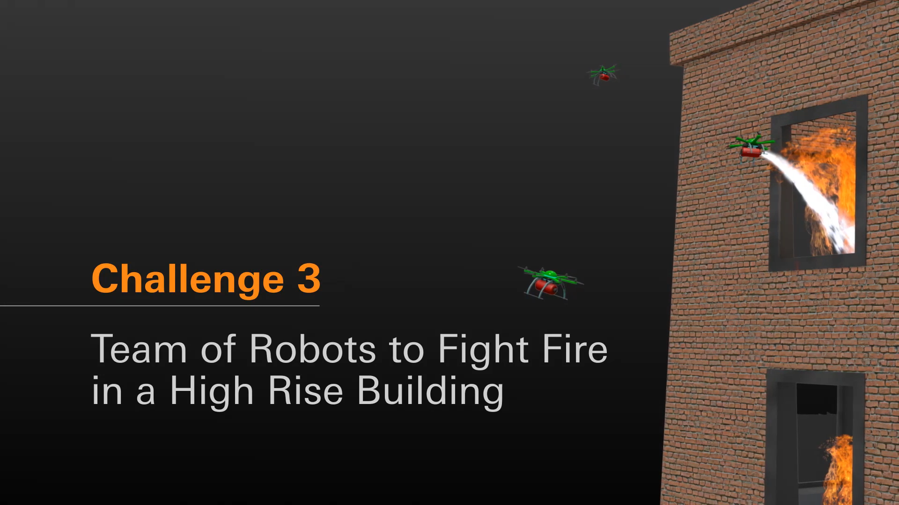

# MBZIRC 2020 Task3
## Task rule: please refer to [official website](https://www.mbzirc.com/challenge/2020)



## real machine
**COMING SOON**

## simulation
```
$ roslaunch hydrus_bringup.launch real_machine:=false simulation:=true headless:=false
```
**caution**: this launch file includes the perception part, so **DO NOT** launch perception in other terminal.
